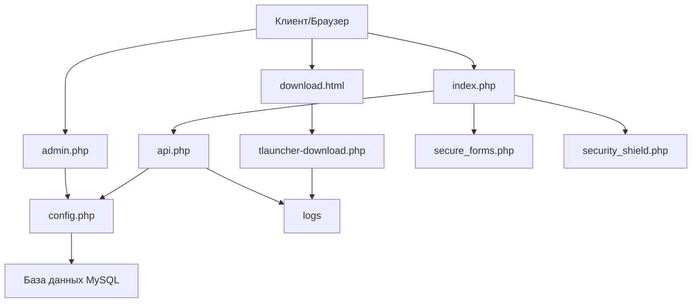

# Документация проекта Minecraft Battle

## 1. Структура проекта

```
minecraftbattle.ru/
  ├── 403.html                    # Страница ошибки 403
  ├── 404.html                    # Страница ошибки 404
  ├── admin.php                   # Панель администратора
  ├── api.php                     # API для взаимодействия с сервером
  ├── config.php                  # Конфигурационный файл
  ├── coreprotect_commands.html   # Документация по командам CoreProtect
  ├── download.html               # Страница загрузки TLauncher
  ├── favicon.ico                 # Иконка сайта
  ├── favicons/                   # Директория с иконками
  │   ├── android-chrome-192x192.png
  │   ├── apple-touch-icon.png
  │   ├── favicon-16x16.png
  │   ├── favicon-32x32.png
  │   ├── favicon.ico
  │   └── site.webmanifest
  ├── index.html                  # Статическая версия главной страницы
  ├── index.php                   # Динамическая версия главной страницы
  ├── logs/                       # Директория с логами
  │   ├── downloads.log           # Логи загрузок
  │   └── site.log                # Логи действий на сайте
  ├── robots.txt                  # Инструкции для поисковых роботов
  ├── secure_forms.php            # Модуль безопасности форм
  ├── security_shield.php         # Модуль защиты сайта
  ├── simpleclans_commands.html   # Документация по командам SimpleClans
  ├── sitemap.xml                 # Карта сайта для поисковых систем
  ├── tlauncher-download.php      # Обработчик загрузки TLauncher
  └── TLauncher-Installer.exe     # Установщик TLauncher
```

## 2. Описание файлов

### config.php
**Назначение**: Основной конфигурационный файл проекта.

**Ключевые функции**:
- `getDatabase()` - Подключение к базе данных MySQL с использованием PDO
- `cleanInput()` - Очистка пользовательского ввода
- `getUserIP()` - Получение IP-адреса пользователя
- `logAction()` - Логирование действий в файл

**Связи с другими файлами**: Импортируется в api.php, admin.php и других файлах, требующих доступ к базе данных или функциям безопасности.

**Логика**: Содержит константы для подключения к базе данных и настройки сервера. Предоставляет базовые функции для работы с данными и безопасности.

### api.php
**Назначение**: API-интерфейс для взаимодействия клиентской части с сервером.

**Ключевые функции**:
- `handleRegistration()` - Обработка регистрации пользователей
- `getParticipantsCount()` - Получение количества зарегистрированных пользователей
- `handleModSuggestion()` - Обработка предложений модов
- `getSettings()` - Получение настроек сайта
- `getCountdownData()` - Получение данных для таймера обратного отсчета
- `getServerInfo()` - Получение информации о сервере

**Связи с другими файлами**: Импортирует config.php, вызывается из JavaScript в index.php.

**Логика**: Обрабатывает AJAX-запросы с клиентской стороны, взаимодействует с базой данных и возвращает данные в формате JSON.

### index.php
**Назначение**: Основная страница сайта.

**Ключевые функции**:
- Отображение информации о сервере
- Регистрация пользователей
- Таймер обратного отсчета до открытия сервера
- Предложение модов для сервера

**Связи с другими файлами**: Взаимодействует с api.php через AJAX-запросы.

**Логика**: Отображает интерактивный интерфейс для пользователей, включая форму регистрации, информацию о сервере и модах.

### admin.php
**Назначение**: Панель администратора для управления сайтом.

**Ключевые функции**:
- Управление пользователями (просмотр, редактирование, удаление)
- Настройка таймера обратного отсчета
- Настройка информации о сервере
- Просмотр предложений модов
- Просмотр системных логов

**Связи с другими файлами**: Импортирует config.php, взаимодействует с базой данных.

**Логика**: Предоставляет административный интерфейс с защитой паролем для управления всеми аспектами сайта.

### secure_forms.php
**Назначение**: Модуль для обеспечения безопасности форм.

**Ключевые функции**:
- `generateCSRFToken()` - Генерация CSRF-токена для защиты форм
- `verifyCSRFToken()` - Проверка CSRF-токена
- `generateSimpleCaptcha()` - Генерация простой капчи
- `verifyCaptcha()` - Проверка ответа капчи
- `isValidEmail()` - Проверка корректности email
- `isValidMinecraftNickname()` - Проверка корректности никнейма Minecraft
- `sanitizeInput()` - Санитизация пользовательского ввода

**Связи с другими файлами**: Может импортироваться в файлах, содержащих формы.

**Логика**: Предоставляет функции для защиты форм от атак и валидации пользовательского ввода.

### security_shield.php
**Назначение**: Модуль защиты сайта от атак и злоупотреблений.

**Ключевые функции**:
- Блокировка вредоносных ботов по User-Agent
- Проверка Referer для POST-запросов
- Ограничение частоты запросов (Rate Limiting)

**Связи с другими файлами**: Может импортироваться в основных файлах для обеспечения безопасности.

**Логика**: Обеспечивает базовую защиту от распространенных атак и злоупотреблений.

### download.html
**Назначение**: Страница для скачивания TLauncher.

**Ключевые функции**:
- Предоставление информации о TLauncher
- Кнопка для скачивания TLauncher
- Пошаговая инструкция по установке и настройке

**Связи с другими файлами**: Ссылается на tlauncher-download.php для скачивания файла.

**Логика**: Предоставляет пользователям информацию и инструкции по скачиванию и установке TLauncher.

### tlauncher-download.php
**Назначение**: Обработчик загрузки TLauncher.

**Ключевые функции**:
- Отправка файла TLauncher-Installer.exe пользователю
- Логирование загрузок

**Связи с другими файлами**: Вызывается из download.html.

**Логика**: Обрабатывает запрос на скачивание, логирует действие и отправляет файл пользователю.

## 3. Архитектура проекта

### Общая структура
Проект представляет собой веб-сайт для Minecraft-сервера с функциями регистрации пользователей, информацией о сервере и возможностью скачать клиент для игры.



### Потоки данных
1. **Регистрация пользователя**:
   - Пользователь вводит данные в форму на index.php
   - JavaScript отправляет AJAX-запрос к api.php
   - api.php валидирует данные и сохраняет в базе данных
   - api.php возвращает результат операции в формате JSON

2. **Скачивание TLauncher**:
   - Пользователь нажимает на кнопку скачивания на download.html
   - Запрос направляется к tlauncher-download.php
   - tlauncher-download.php логирует загрузку и отправляет файл пользователю

3. **Административные действия**:
   - Администратор авторизуется в admin.php
   - admin.php взаимодействует с базой данных через функции из config.php
   - Изменения сохраняются в базе данных и отображаются в интерфейсе

## 4. Библиотеки/фреймворки

### PHP
- **PDO** - Используется для безопасного взаимодействия с базой данных MySQL
  - Применяется в config.php, api.php, admin.php

### JavaScript
- **Vanilla JavaScript** - Используется для клиентской логики
  - Обработка форм, AJAX-запросы, анимации, таймер обратного отсчета
  - Применяется в index.php, download.html

### CSS
- **Собственные стили** - Без использования внешних CSS-фреймворков
  - Адаптивный дизайн, анимации, эффекты
  - Применяется во всех HTML/PHP файлах

### Шрифты
- **Google Fonts** - Подключение шрифтов Press Start 2P и Roboto
  - Применяется в index.php, download.html, admin.php

## 5. Точка входа и запуск

### Основной сайт
- **Точка входа**: index.php
- **Процесс запуска**:
  1. Загрузка конфигурации и подключение к базе данных (при необходимости)
  2. Отображение HTML-контента
  3. Выполнение JavaScript для инициализации интерактивных элементов
  4. AJAX-запросы к api.php для получения данных

### Панель администратора
- **Точка входа**: admin.php
- **Процесс запуска**:
  1. Проверка авторизации
  2. Если пользователь не авторизован, отображение формы входа
  3. Если пользователь авторизован, загрузка данных из базы данных
  4. Отображение административного интерфейса

## 6. Архитектурные особенности

### Нестандартные решения
1. **Комбинация статических и динамических страниц**:
   - index.php содержит как статический HTML, так и динамический контент, загружаемый через AJAX
   - Это позволяет снизить нагрузку на сервер и ускорить загрузку страницы

2. **Модульная система безопасности**:
   - Разделение функций безопасности на отдельные модули (secure_forms.php, security_shield.php)
   - Позволяет гибко применять меры безопасности в разных частях сайта

3. **Логирование действий**:
   - Все важные действия логируются в файлы в директории logs/
   - Позволяет отслеживать активность пользователей и потенциальные проблемы

### Причины выбора архитектуры
1. **Простота и легковесность**:
   - Отсутствие тяжелых фреймворков позволяет сайту быстро загружаться
   - Упрощает поддержку и модификацию кода

2. **Безопасность**:
   - Использование PDO для защиты от SQL-инъекций
   - Валидация и санитизация пользовательского ввода
   - Защита от CSRF-атак и ограничение частоты запросов

3. **Адаптивность**:
   - Отзывчивый дизайн для мобильных и десктопных устройств
   - Динамическая загрузка контента для улучшения пользовательского опыта

4. **Масштабируемость**:
   - Модульная структура позволяет легко добавлять новые функции
   - Отделение API от представления упрощает расширение функциональности

Проект представляет собой компактный, но функциональный веб-сайт для Minecraft-сервера с фокусом на безопасность, производительность и удобство использования.
